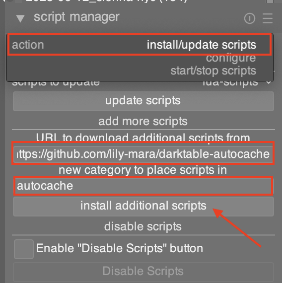
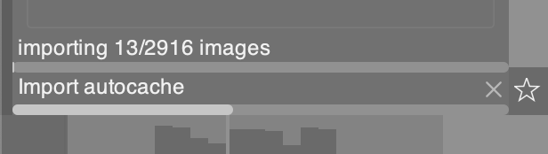

# Darktable Autocache

If you're like me, you love [Darktable](https://www.darktable.org) but find it
quite slow to use for navigating images. Darktable comes with a built-in
[caching
system](https://docs.darktable.org/usermanual/4.2/en/lighttable/digital-asset-management/thumbnails/),
but it seems to not want to generate useful thumbnail caches at import time
(like the manual says it's supposed to). This LUA plugin is designed to bridge
this gap by automatically generating high-quality image thumbnail cache for all
images at the time they're imported.

## Installation

Use the "Install/Update" action in the "script manager" tab of the lighttable
view to enter the path to this repository -
"https://github.com/lily-mara/darktable-autocache", and write "autocache" as the
category name (this is not significant from a technical perspective, but it is
useful for your own organization). Next, click the "install additional scripts" button.

After this, you should be taken to a view showing your newly installed script
with a box that says "autocache stopped". By default, Darktable does not run
plugins immediately after install, you need to manually enable them. Click this
box and the text should change to "autocache started" and you should see a toast
message reading "Loaded autocache/autocache".

You also need to make sure that your settings are compatible with this plugin.
You _must_ enable the "processing > cpu / gpu / memory > enable disk backend for
full preview cache" setting for this plugin to have its full effect. Enabling
this plugin without enabling that toggle could have unintended performance
issues.

At this point, you're all set!

## Usage

Once enabled, the plugin should all but disappear into the background. As you
import new images, the plugin will automatically run in the background, caching
image previews and showing you a progress bar of the process.

## Effects

Enabling this plugin has very clear benefits and costs.

### Benefits

You should notice that newly imported images are _much_ faster to navigate in
the lighttable view after the autocache process has completed.

### Costs

Importing images will now burn more compute resources (CPU or maybe GPU
depending on your setup) because in addition to the normal import flow, you will
also be running the intensive preview generation step ahead of time.

The "full" import process (actual import + autocache) will now take longer than
before, for the same reason as above. You should be able to browse your newly
imported images _while autocache is running_, but you will not see the same
performance gains as you will once it's completed.

Disk usage from caching will increase significantly. Storing high-quality image
previews is not free from a storage perspective. For my library of ~8k RAW
images, the full cache takes about 15GiB of disk space. If storage is at a
premium for you, this plugin may not be ideal.

## Alternatives

This plugin doesn't invent anything. All of the functionality that this plugin
performs is built-in to Darktable, it's just not done _automatically_. There are
a few ways to accomplish what this plugin does without installing it.

1. After importing images, page through every image you've imported. This forces
   Darktable to generate and store preview files.
2. Run `darktable-generate-cache -m 6` after each import. This generates the
   same quality preview files that this plugin does, but it doesn't allow you to
   use Darktable while the generation is happening and it's not automatic.
